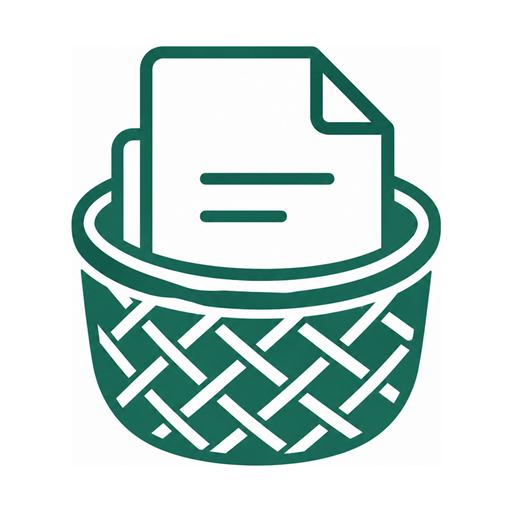

# DokoDocs Android (Native Edition)

<p align="center">
  
</p>

<h3 align="center">नेपालको आफ्नै स्मार्ट डकुमेन्ट स्क्यानर (Product of Bhrikuty)</h3>

<p align="center">
  <strong>100% Offline • CamScanner-Grade Mesh Dewarping • Dual Nepali (BS) & Gregorian (AD) Calendar • Apple HIG Aesthetic</strong>
</p>

---

## 📱 Features

- **CamScanner-Grade Smart Dewarping Engine**: Hardware-accelerated $8 \times 8$ spline mesh dewarping for curved book pages, bi-fold/tri-fold documents, and folded paper.
- **Missing Corner & Boundary Inference**: Geometric line intersection algorithms to infer cut-off or occluded corners with color-coded confidence indicators.
- **Physical Aspect Ratio Classifier**: Automatic detection for A4, A3, A5, Letter, Legal, Receipts, Books, and Identity Cards (Citizenship / NID / Driving License).
- **Dual Nepali (BS) & Gregorian (AD) Calendar**: Live Bikram Sambat date conversion engine (2060–2095 BS) with dual date pickers and Devanagari numerals.
- **ID / Both-Sides Capture Mode**: Seamless 2-sided capture flow with flip reminder prompts and automatic 2-Up Single-A4 PDF generation.
- **Scan Quality Analyzer**: Real-time 0–100 quality scoring with a $4 \times 4$ Laplacian regional blur grid, glare detector, and bilingual English/Nepali feedback.
- **Government-Form-Ready PDF Presets**:
  - Standard A4 / Letter High Quality
  - Lok Sewa / PSC Portal Preset ($\le 200\text{ KB}$)
  - Nagarik App / e-Passport Preset ($\le 500\text{ KB}$)
  - 2-Up Single-A4 ID / Citizenship layout
- **Privacy Redaction**: One-tap masking tool to blackout sensitive numbers, PAN, and signatures before export.
- **100% Local-First & Private**: Built on Room SQLite with zero tracking, no cloud dependencies, and full offline functionality.
- **Apple Human Interface Guidelines (HIG) Aesthetic**: Cupertino Inset Grouped cards, Apple squircle iconography, frosted glass headers, and San Francisco typography hierarchy.

---

## 🏗️ Architecture & Technology Stack

- **UI Framework**: Jetpack Compose (Material 3 with Apple HIG design system)
- **Camera Pipeline**: AndroidX CameraX (Camera2, Lifecycle, PreviewView)
- **Computer Vision**: Hardware-accelerated `Canvas.drawBitmapMesh`, custom OpenCV-equivalent luminance levelers, and geometric homography algorithms
- **Database**: Room Database (SQLite with Flow and Coroutines)
- **PDF Engine**: Native Android `PdfDocument` & `PdfRenderer`
- **Minimum Android SDK**: Android 8.0 (API 24)
- **Target Android SDK**: Android 15 (API 35)

---

## 🛠️ Building & Running

### Prerequisites
- Android Studio Ladybug / Koala or newer
- JDK 17 (bundled in Android Studio as JBR)
- Android SDK 35

### Command-Line Build
```bash
# Debug APK
./gradlew assembleDebug

# Production Release APK
./gradlew assembleRelease
```

The output APK will be available in:
`app/build/outputs/apk/release/app-release.apk`

---

## 📄 License & Attribution

Developed by **Bhrikuty (भृकुटी)**. All rights reserved.
